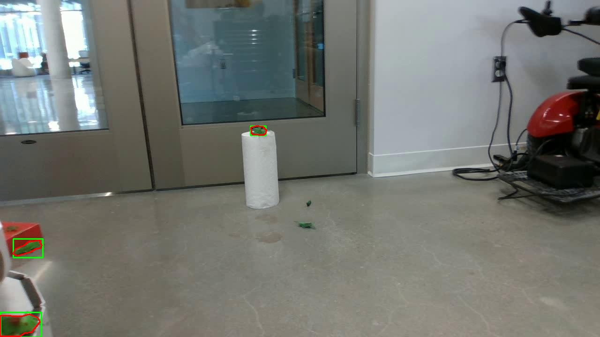
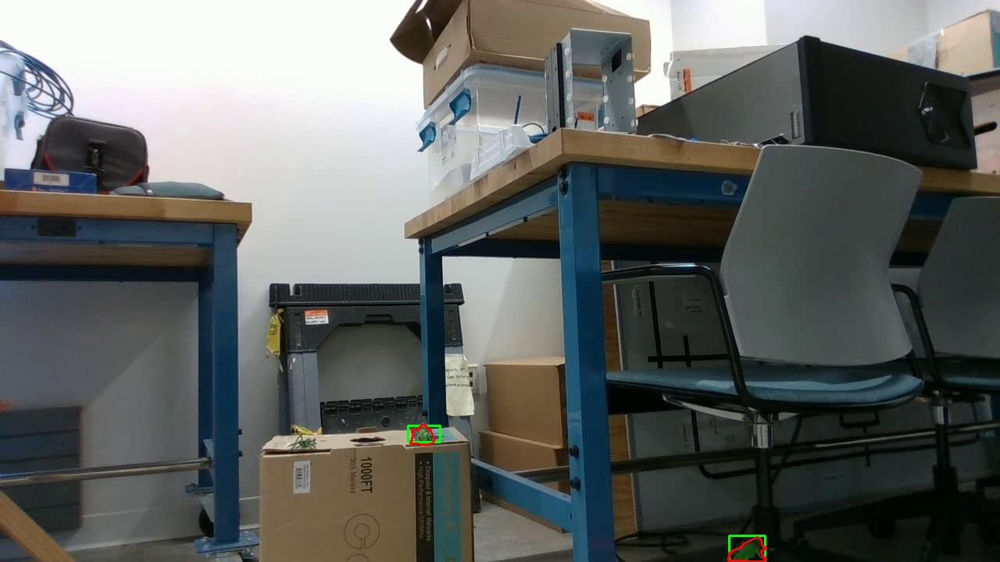
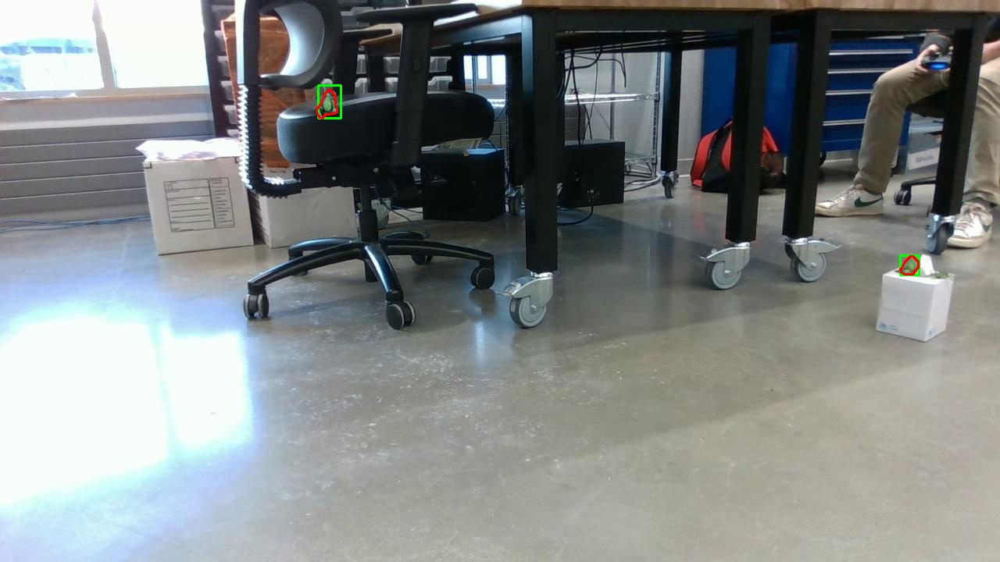

# auto_segment

Automatically converts YOLO bounding box annotations to instance segmentation masks using Meta's [Segment Anything Model (SAM)](https://github.com/facebookresearch/segment-anything). Designed to run in Google Colab.

## What it does

Takes a YOLO dataset with bounding box labels and outputs polygon-based segmentation labels in YOLO format — ready for training a YOLOv8 segmentation model — without any manual annotation. The bounding box annotations in this project were originally created using [Roboflow](https://roboflow.com).

**Pipeline:**
1. Load each image and its YOLO bounding box labels
2. Feed each bounding box to SAM as a prompt
3. SAM returns a segmentation mask for the detected object
4. The mask is traced to a polygon and simplified using the Douglas-Peucker algorithm
5. Output is written as normalized YOLO polygon labels (`.txt`)

If SAM fails to produce a valid mask for an object, the original bounding box line is kept as a fallback.

## Requirements

```
torch
opencv-python
numpy
tqdm
segment-anything
```

SAM checkpoint weights are downloaded automatically when missing. Pass `model_type` to select:
- `vit_b` — `sam_vit_b_01ec64.pth` (faster, recommended for most use cases)
- `vit_h` — `sam_vit_h_4b8939.pth` (highest quality, slower)

## Dataset structure

```
dataset/
├── images/
│   ├── img_001.jpg
│   └── ...
└── labels/
    ├── img_001.txt   # YOLO bounding box format
    └── ...
```

Each label file follows standard YOLO format:
```
<class_id> <x_center> <y_center> <width> <height>
```

## Usage

Open `auto_segment.ipynb` in Google Colab and run all cells, or configure the paths at the bottom:

```python
IMAGES_DIR = "dataset/images"
LABELS_DIR = "dataset/labels"
OUTPUT_DIR = "segmentation_labels/train"
MODEL_TYPE = "vit_b"  # "vit_b" (faster) or "vit_h" (best quality)

main(IMAGES_DIR, LABELS_DIR, OUTPUT_DIR, MODEL_TYPE)
```

Converted labels are saved to `OUTPUT_DIR`. For the first 3 images, a debug visualization is saved to `readme_images/<image_name>_debug.jpg` showing the original bounding boxes (green) and generated polygons (red).

## Examples

Debug visualizations are saved for the first 3 images processed. Green = original bounding box, red = SAM-generated segmentation polygon.





## Output format

Each output label file uses YOLO segmentation format:
```
<class_id> <x1> <y1> <x2> <y2> ... <xn> <yn>
```
Coordinates are normalized to `[0, 1]`.

## Training with YOLOv8

After conversion, update your `dataset.yaml` to point at the new segmentation labels directory and train:

```bash
yolo segment train data=dataset.yaml model=yolov8s-seg.pt epochs=50
```

## Notes

- GPU (`cuda`) is used automatically when available; falls back to CPU.
- Objects with masks smaller than 10 pixels or fewer than 3 contour points fall back to the original bounding box entry.
- Polygon simplification tolerance defaults to `0.01` (1% of contour arc length); adjust `tolerance` in `mask_to_yolo_polygon` for more or fewer polygon points.
