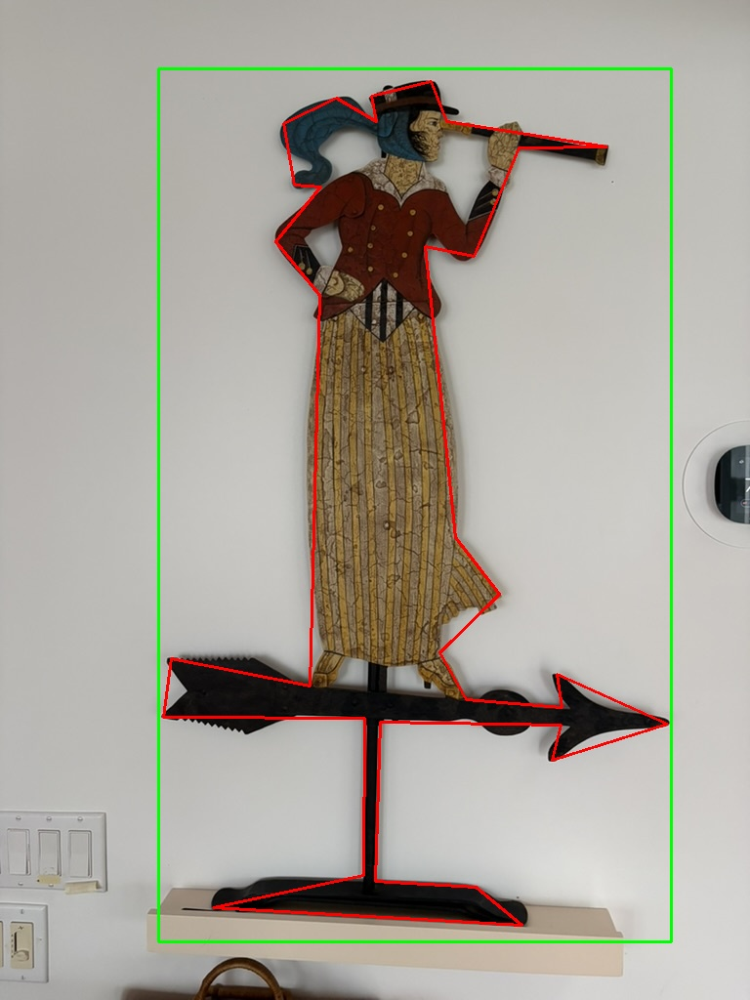
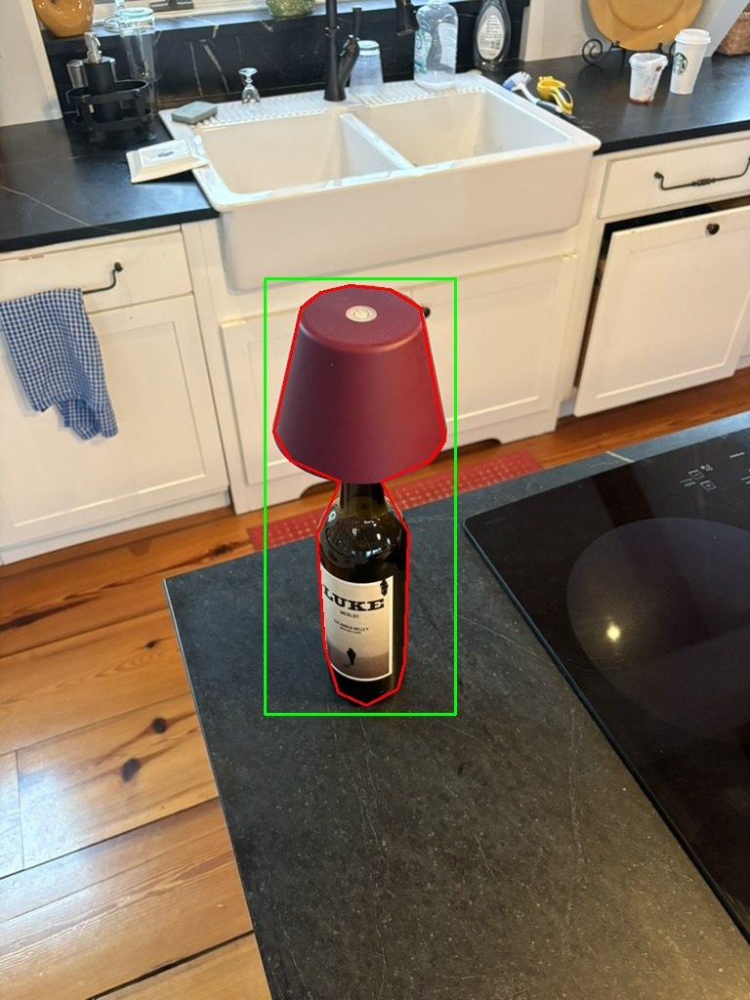
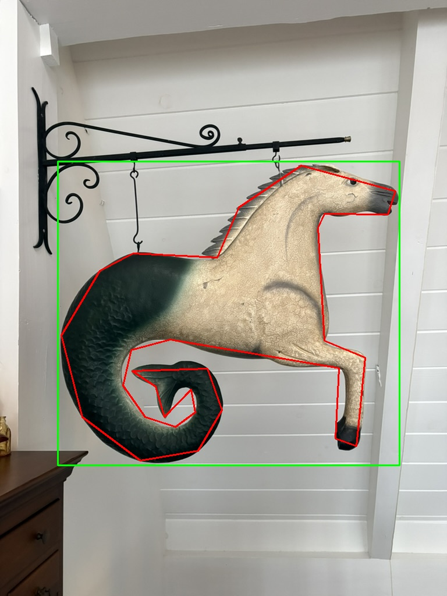
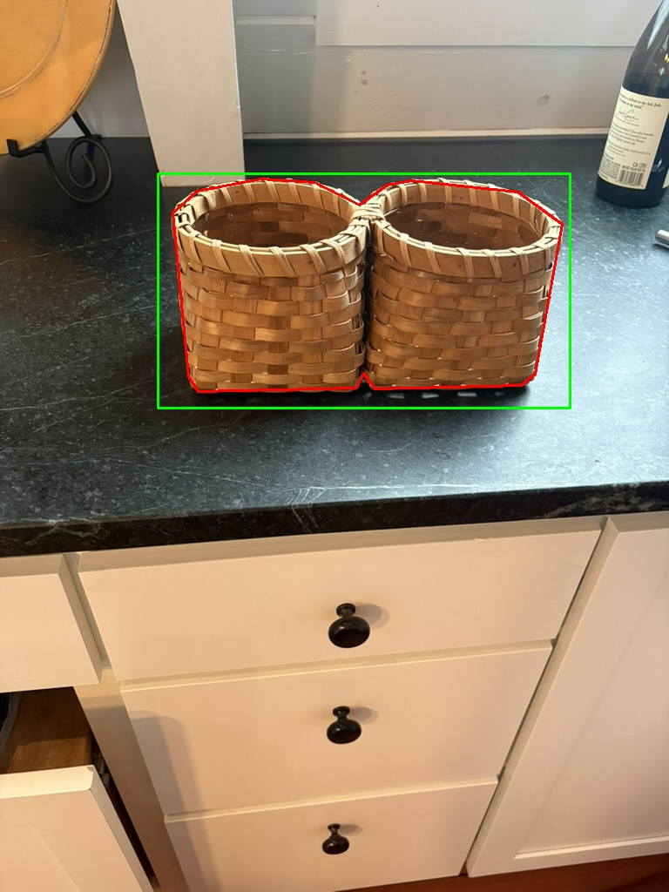
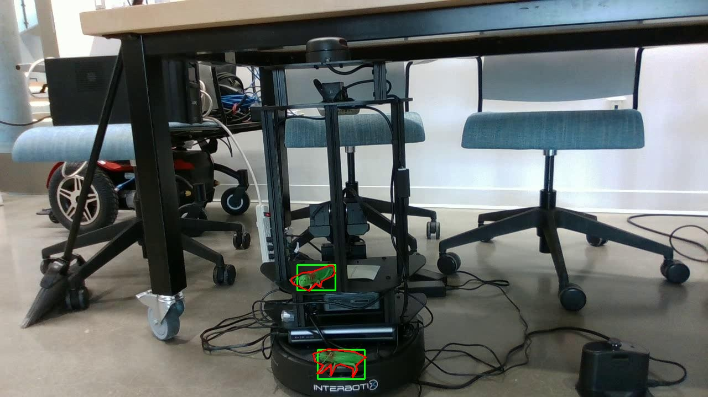

# auto_segment

Automatically converts YOLO bounding box annotations to instance segmentation masks using Meta's [Segment Anything Model (SAM)](https://github.com/facebookresearch/segment-anything).

## What it does

Takes a YOLO dataset with bounding box labels and outputs polygon-based segmentation labels in YOLO format — ready for training a YOLOv8 segmentation model — without any manual annotation. The bounding box annotations in this project were originally created using [Roboflow](https://roboflow.com).

**Pipeline:**
1. Load each image and its YOLO bounding box labels
2. Feed each bounding box to SAM as a prompt
3. SAM returns a segmentation mask for the detected object
4. The mask is traced to a polygon and simplified using the [Douglas-Peucker algorithm](https://en.wikipedia.org/wiki/Ramer%E2%80%93Douglas%E2%80%93Peucker_algorithm)
5. Output is written as normalized YOLO polygon labels (`.txt`)

## Motivation: Roboflow Auto Label — locally

This pipeline replicates what [Roboflow Auto Label](https://roboflow.com/annotate/auto-label) does as a paid cloud feature — completely free and on your own machine. Roboflow's Auto Label uses SAM under the hood: it accepts a bounding box as a spatial prompt, generates a segmentation mask, and exports the result as a polygon annotation. `auto_segment` follows the exact same approach.

| Step | Roboflow Auto Label | auto_segment |
|---|---|---|
| Input | Bounding box annotation | YOLO `.txt` bbox file |
| Foundation model | SAM / Grounding DINO | SAM (`vit_b` or `vit_h`) |
| Prompt strategy | Box prompt to SAM | `predictor.predict(box=...)` |
| Output format | Polygon (YOLO / COCO) | YOLO segmentation polygon |
| Fallback | Manual review queue | Keeps original bbox line |
| Cost | ~$0.01–0.02 / image | Free, runs locally |

The key quality gates — minimum mask area, minimum contour point count, and polygon simplification via Douglas-Peucker — are the same mechanisms Roboflow applies to keep auto-generated labels clean and lightweight.

## Use in lips_ws (Locobot)

The segmentation labels produced here are used to train a YOLOv8-seg model deployed on a [Locobot](https://www.trossenrobotics.com/locobot-ros-autonomous-mobile-research-robot) in the [`lips_ws`](https://github.com/anramz29/lips_ws) ROS1 workspace. The full data-to-robot pipeline is:

```
Roboflow (bbox labels)
        ↓
  auto_segment  ← this repo
        ↓
  YOLOv8-seg training
        ↓
  yolo_node.py on Locobot
        ↓
  Live instance segmentation on robot camera feed
```

Inside `lips_ws`, the `yolo_vision` package loads the trained model and subscribes to the robot's camera topic. Upgrading from bounding boxes to segmentation masks gives downstream nodes — `distance_node`, `object_mapper_node`, and `search_and_approach_node` — a tighter object footprint to work with, improving depth-based distance estimation and map localization.

If SAM fails to produce a valid mask for an object, the original bounding box line is kept as a fallback.

## Requirements

```
torch
opencv-python
numpy
tqdm
segment-anything
```

SAM checkpoint weights are downloaded automatically when missing. Pass `model_type` to select:
- `vit_b` — `sam_vit_b_01ec64.pth` (faster, recommended for most use cases)
- `vit_h` — `sam_vit_h_4b8939.pth` (highest quality, slower)

## Dataset structure

```
dataset/
├── images/
│   ├── img_001.jpg
│   └── ...
└── labels/
    ├── img_001.txt   # YOLO bounding box format
    └── ...
```

Each label file follows standard YOLO format:
```
<class_id> <x_center> <y_center> <width> <height>
```

## Usage

Open `auto_segment.ipynb` in Google Colab and run all cells, or configure the paths at the bottom:

```python
IMAGES_DIR = "dataset/images"
LABELS_DIR = "dataset/labels"
OUTPUT_DIR = "segmentation_labels/train"
MODEL_TYPE = "vit_b"  # "vit_b" (faster) or "vit_h" (best quality)

main(IMAGES_DIR, LABELS_DIR, OUTPUT_DIR, MODEL_TYPE)
```

Converted labels are saved to `OUTPUT_DIR`. A debug visualization overlay is saved to `readme_images/<image_name>_debug.jpg` for the first `debug_first_n` images (default: 4), showing the original bounding boxes (green) and generated polygons (red).

## Examples

Green = original bounding box prompt · Red = SAM-generated segmentation polygon

### Out-of-domain test images

These images were run through the pipeline without any retraining to verify that SAM generalises beyond the training dataset. Each is a completely different object category.

| Weather vane | Wine bottle + lamp shade |
|:---:|:---:|
|  |  |

| Seahorse figure | Woven baskets |
|:---:|:---:|
|  |  |

### Training dataset (grasshoppers)

The targets are small plastic grasshoppers. There are also plastic crickets which are green and similarly shaped, making them a good robustness test for the segmentation pipeline.




## Output format

Each output label file uses YOLO segmentation format:
```
<class_id> <x1> <y1> <x2> <y2> ... <xn> <yn>
```
Coordinates are normalized to `[0, 1]`.

## Training with YOLOv8

After conversion, update your `dataset.yaml` to point at the new segmentation labels directory and train:

```bash
yolo segment train data=dataset.yaml model=yolov8s-seg.pt epochs=50
```

## Notes

- GPU (`cuda`) is used automatically when available; falls back to CPU.
- Objects with masks smaller than 10 pixels or fewer than 3 contour points fall back to the original bounding box entry.
- Polygon simplification tolerance defaults to `0.01` (1% of contour arc length); pass `tolerance=` to `main()` to adjust — lower values produce more polygon points and finer detail, higher values produce fewer points and a coarser outline.
